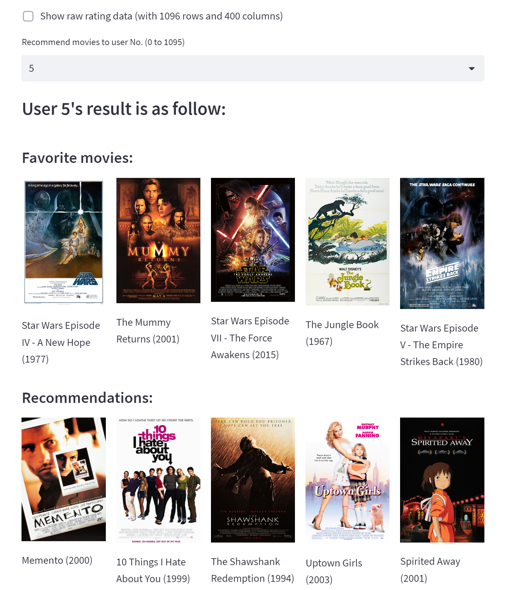
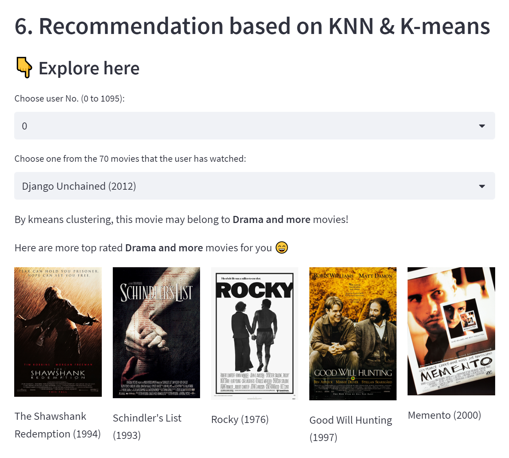

# Movie Recommendation

Project highlights: **KNN**, **K-means**, **PCA**, **Data visualization**, **Recommender system**
    

_Explore this project on our [online demo](http://nuolei-movie.streamlit.app) in one click_
_Step by step analysis in [jupyter-notebook](https://github.com/NuoLeiNYU/movie-recommendation-system/blob/master/movie_recommender_analysis.ipynb)_

## 1.Introduction

Movie recommendation is an exciting topic closely related to our daily lives.
It saves our precious time and energy to choose from millions of movies.
But no one could ever go through all millions of movies so as to make a good recommendation.
So this is the time when data science techniques such as **K Nearest Neighbor (KNN)** and **K-means** can help.
Here we will first use KNN model and then improve it with K-means clustering. Fun!

## 2. How does KNN work here?
### _A user-user approach_
The idea of KNN model is quite intuitive. 
Imagine that you are in a movie lover's club at NYC.
You have fun and meet a bunch of friends who are eager to share you their favorite movies.
Who's recommendation should you take? 
The one who have the same taste just like you, or the one who disagree with your opinion on every single movie?
Well, of course it is important sometimes to be open to different opinions. 
But as for a movie to relax after a day of tiring work, I would go with the recommendation from my like-minded friends.

KNN model just follows this intuition and asks for the opinion of $K$ like-minded 'friends'.
With a similar taste, it is reasonable to assume that I would have a similar rating like my 'friends' though I haven't seen the movie yet.
In this way, we successfully estimate the rating of movies by the average rating of like-minded people. 

The following is a easy demo of 1097 people (one is missing) and their ratings for 400 movies (movies haven't seen are rated as NaN).
Based on KNN, we can recommend movies for each of them!

## 3. Recommendation based on KNN


<div id="images" align="center">
    <a href="https://nuolei-movie.streamlit.app/">
    </a>
    <!-- <a href="https://nuolei-movie.streamlit.app/" target="_blank">
    </a> -->
</div>


## 4. Can we do more?
### What we have done

Here we employed KNN model to complete the rating matrix.
Therefore we can recommend movies for users by sorted rating.
This method ensures that the recommendations are movies highly rated by like-mined people.

### Where to improve?
Except for overall recommendation, we have a lot of other real-world scenarios!
When I just finished a great movie, chances are that I would want more movies of the same kind.
Well, clustering model can help us do that!

In the next part, we will deploy the basic clustering model **K-means** to recommend movies in the same genre.

## 5. How does K-means work here

### _An item-item approach_

The idea of K-means is quite similar to KNN with a little bit difference. 
In the KNN part we want the average rating from K like-minded friends.
But here we want more than that. We not only want to find similar movies, 
but also want to further group them up and give each groups **meaningful interpretation**!

In short by Silhouette score, our clustering result shows that there are **three** possible movie clusters. 
We further take mean average and take a look at the top 10 movies in each group.


<center>
<div id="images" align="center">
    <!-- <a href="https://nuolei-movie.streamlit.app/">
    </a> -->
    <a href="https://nuolei-movie.streamlit.app/" target="_blank">
    </a>
</div>
</center>

## 7. To do even better?

### More features!
We can take into account many other factors such as **staring actors**, **director**, **language**, **area**, **length**, etc. 
We can even employ NLP methods to analyse audiences' **movie reviews** and construct our own features!

### More samples!
Our sample size 1097 is a big number. 
But considering the huge user amount in movie companies database, we can of course simply do better by having a larger sample (With far more movies and more users!).

### More powerful models!
We adopt KNN and K-means model because of their **simplicity** and good **interpretability**.
But in industrial applications we may have much more to worry about, 
like in model performance and speed in real-time recommendation and so on.
So it is a discretionary call and we may employ more SOTA models in that case.
    

## File structure

```bash
├─ data 
│  └─ movieReplicationSet.csv # 1097 people's rating of 400 movies.
├─ image # 400 movie posters for result visualization.
│  ├─ 10 Things I Hate About You (1999).png
│  ├─ 10000 BC (2008).png
│  ├─ 12 Monkeys (1995).png
   ...
│  ├─ Wing Commander (1999).png
│  ├─ X-Men (2000).png
│  ├─ X-Men 2 (2003).png
│  ├─ You're Next (2011).png
│  └─ Zoolander (2001).png
├─ readme
├─ tools # web crawler for movie posters.
│  └─ get_movie_cover.py
├─ README.md
├─ movie_recommend.py # main py file for KNN recommendation and webpage rendering.
├─ movie_recommender_analysis.ipynb # A full data analysis in jupyter-notebook
└─ requirements.txt

```

## Thank you for exploring!

A full data analysis is in this [jupyter-notebook](https://github.com/NuoLeiNYU/movie-recommendation-system/blob/master/movie_recommender_analysis.ipynb).

More on my [github](https://github.com/NuoLeiNYU).
